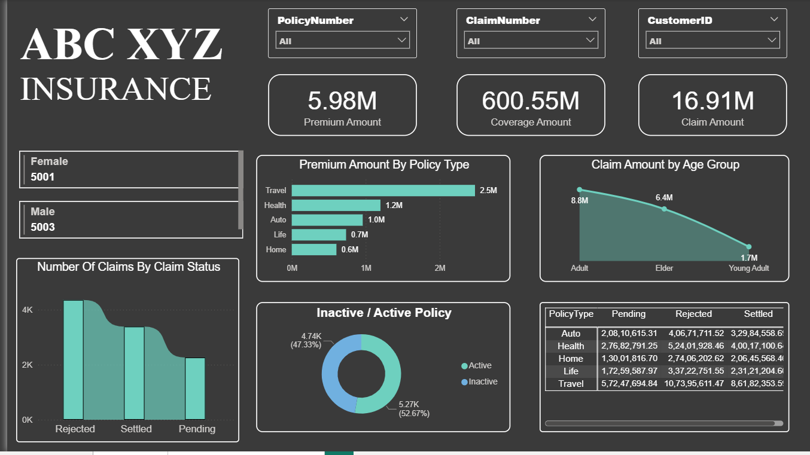
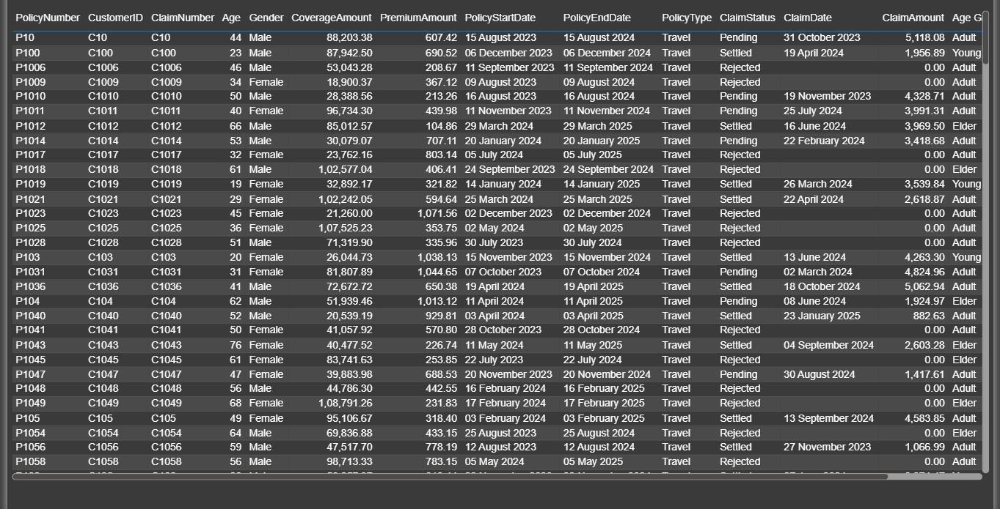

# 📊 Power BI Project – Insurance Data Analysis

An interactive Power BI dashboard built to analyze insurance data, track KPIs, and provide insights into customer behavior and policy trends.  
This project demonstrates data cleaning, transformation, and visualization to create a decision-support dashboard.

---

## 🔗 Table of Contents
- [📘 Project Overview](#-project-overview)
- [📁 Folder Structure](#-folder-structure)
- [📦 Dataset Description](#-dataset-description)
- [📊 Dashboard Features](#-dashboard-features)
- [📸 Dashboard Images](#-dashboard-images)
- [🛠️ Tools Used](#️-tools-used)
- [✍️ Author](#-author)

---

## 📘 Project Overview
The **Insurance Data Analysis Dashboard** helps to monitor customer and policy-related KPIs.  
It allows analysis of active/inactive policies, premium amounts, claim status, and demographic distribution, enabling businesses to make data-driven decisions.

---

## 📁 Folder Structure

insurance-data-analysis/
│
├── 01_Data/
│   └── InsuranceData.csv
│
├── 02_PowerBI_Dashboard/
│   └── Insurant Data Project.pbix
│
├── 03_Images/
│   ├── 1.png
│   ├── 2.png
│   └── 3.png
│
└── README.md

---

## 📦 Dataset Description
The dataset (**InsuranceData.csv**) contains details such as:
- **Customer ID & Demographics** – Age, Gender, Region  
- **Policy Information** – Policy ID, Start Date, End Date, Policy Type  
- **Financials** – Premium Amount, Claim Amount  
- **Status** – Active/Inactive policies, Claim Status  

---

## 📊 Dashboard Features
📂 [View PBIX File](./02_PowerBI_Dashboard/Insurant%20Data%20Project.pbix)

- KPI cards for total customers, policies, premium collected, and claims  
- Distribution of customers by age group and gender  
- Active vs. inactive policies analysis  
- Claims ratio and average premium insights  
- Interactive filters for policy type, gender, and region  

---

## 📸 Dashboard Images
  
  

---

## 🛠️ Tools Used
- **Power BI** – Data visualization & dashboard creation  
- **Excel/CSV** – Raw data storage  
- **DAX** – Calculated measures for KPIs  
- **Power Query** – Data cleaning & transformation  

---

## ✍️ Author
**Gulbaaz**  
DTU’22 | Aspiring Data & Business Analyst | SQL, Excel, Power BI Projects on GitHub  
📫 [GitHub Profile](https://github.com/Gulbaaz)
